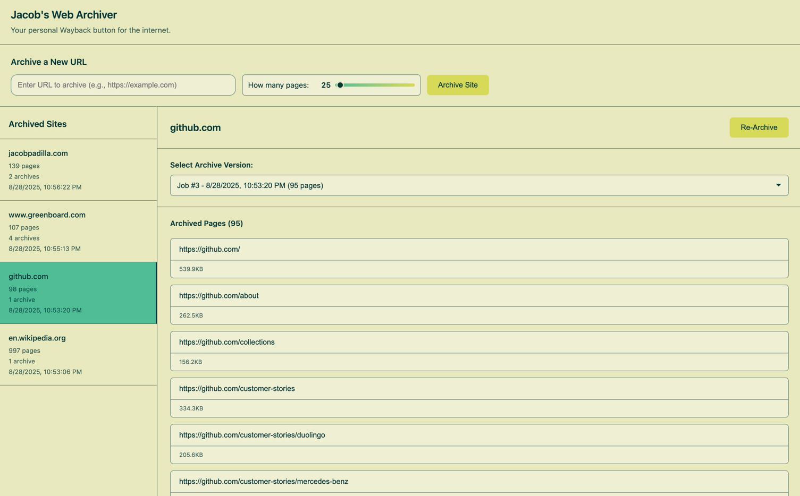
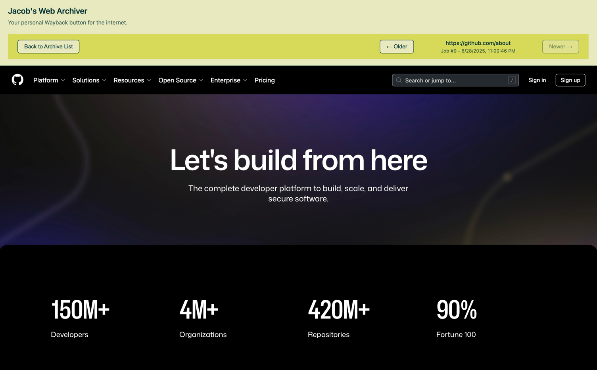

# Web Archiver

This project provides a simple archiving solution for the web.  

It includes three main components:

- **Database** (Postgres)
- **API** (FastAPI backend with an Async crawler)
- **Web** (React + Nginx frontend)


After cloning the repository, simply start the project with the following command:

   ```bash
   docker compose up --build
   ```

Access the services:
   * **Frontend:** [http://localhost:8000](http://localhost:8000)
   * **API:** [http://localhost:8001](http://localhost:8001)



